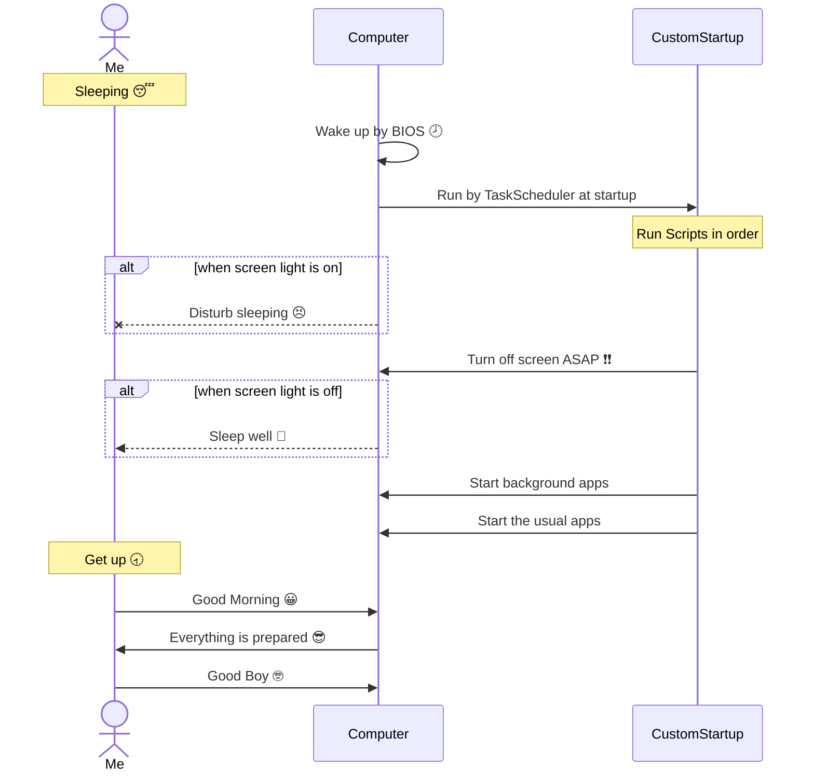

# CustomStartup

This is my pet project.
Run apps **in order** automatically at startup in Windows with registering vbs in taskscheduler's logon trigger.

## Samples

### Use library
```powershell
  using module ".\lib\RunAsync.psm1"
```

### Run notepad.exe
```powershell
  RunAsync "Notepad.exe"
```

### Run notepad.exe and wait for opening window
```powershell
  RunAsync "Notepad.exe" -WinTitle "Untitled - Notepad"
```

### Run notepad.exe and minimize it
```powershell
  RunAsync "Notepad.exe" -WinTitle "Untitled - Notepad" -HideWin
```

### Open task manager and hide it on system tray (need admin rights)
```powershell
  RunAsync "Taskmgr.exe" -WinTitle "Task Manager" -HideWin
```

### How to find WinTitle string
```powershell
  Get-Process | ? {$_.ProcessName -eq "notepad"} | Format-Table MainWindowTitle
```
```powershell
  Get-Process | ? {$_.MainWindowTitle} | Format-Table MainWindowTitle
```

## Save my sleep

